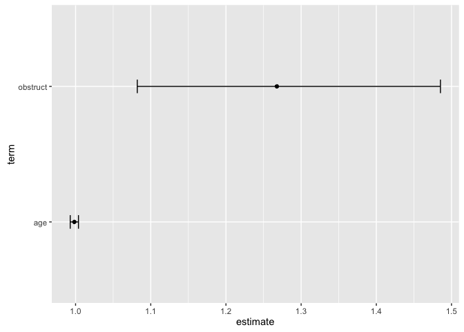
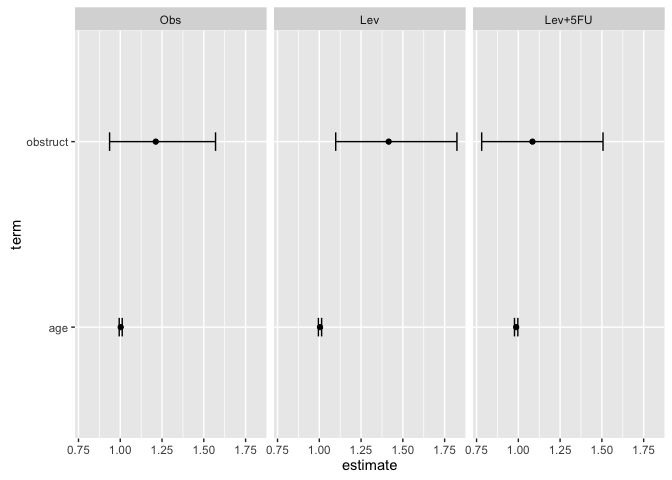
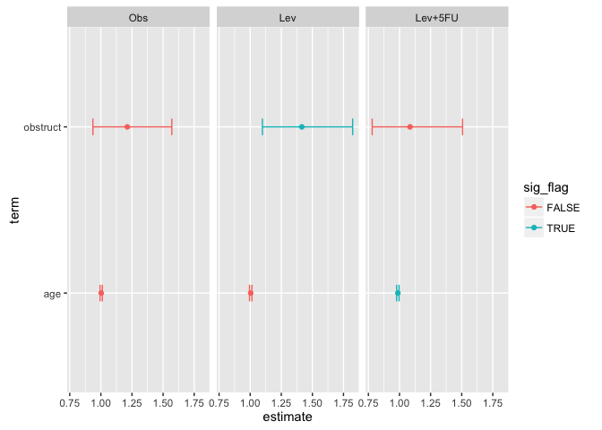
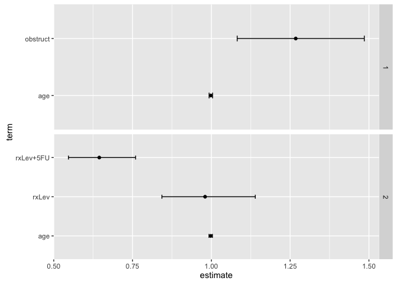

<!-- README.md is generated from README.Rmd. Please edit that file -->
survutils
=========

[](http://cran.r-project.org/package=survutils)

An R package for Survival Analysis. This package mainly serves as a wrapper around various survival analysis functions (e.g. `coxph`, `survdiff`) to provide a more inituitive interface and output in [tidy data format](http://vita.had.co.nz/papers/tidy-data.pdf). It has the following features (grouped by major topics):

Cox Regression

-   `get_cox_res`: Run univariate or multivariate cox regression.
-   `iter_get_cox_res`: Wrapper over `get_cox_res` to allow to faciliate ease of multiple `get_cox_res` runs.
-   `plot_cox_res`: Generates a forest plot of the univariate or multivariate cox regression results from `get_cox_res`.

Kaplan Meier Estimates/Curves

-   `get_surv_prob`: Calculates the survival probability at specified times from a survival curve.
-   `get_nrisk_tbl`: Provides a number at risk table as [typically seen in publications](https://mcfromnz.wordpress.com/2011/11/06/kaplan-meier-survival-plot-with-at-risk-table/).
-   `get_logrank_res`: Runs a log-rank test.

Other

-   `get_c_stat`: Calculate C-statistics.

How to Install
==============

To install this package using devtools:

``` r
devtools::install_github("tinyheero/survutils")
```

Cox Regression
==============

`survutils` provides a nice wrapper function `get_cox_res` that allows you to quickly run an univariate or multivariate cox regression on a set of data. The input data is a data.frame for instance (taking the colon dataset from the `survival` R package as the example):

``` r
library("survival")
library("knitr")
library("survutils")
library("dplyr")

head(colon) %>%
    select(age, obstruct, time, status, rx) %>%
    kable
```

|  age|  obstruct|  time|  status| rx      |
|----:|---------:|-----:|-------:|:--------|
|   43|         0|  1521|       1| Lev+5FU |
|   43|         0|   968|       1| Lev+5FU |
|   63|         0|  3087|       0| Lev+5FU |
|   63|         0|  3087|       0| Lev+5FU |
|   71|         0|   963|       1| Obs     |
|   71|         0|   542|       1| Obs     |

The relevant columns are:

-   `age` and `obstruct`: These are the features we want to regress on.
-   `time`: Time to event.
-   `status`: Event status (1 for event; 0 for non-event).
-   `rx`: Different treatment groups.

Then to run `get_cox_res`:

``` r
endpoint <- "time"
endpoint.code <- "status"
 
features <- c("age", "obstruct")
cox.res.df <- get_cox_res(colon, endpoint, endpoint.code, features)
kable(cox.res.df)
```

| term     |   estimate|  std.error|   statistic|    p.value|   conf.low|  conf.high| test\_type |
|:---------|----------:|----------:|-----------:|----------:|----------:|----------:|:-----------|
| age      |  0.9983432|  0.0028040|  -0.5913434|  0.5542904|  0.9928717|   1.003845| multicox   |
| obstruct |  1.2677379|  0.0808045|   2.9359039|  0.0033258|  1.0820531|   1.485287| multicox   |

This runs a multivariate cox regression on the entire set of data. We can plot the results using `plot_cox_res`:

``` r
plot_cox_res(cox.res.df)
```



This gives us a forest plot with the hazard ratio and confidence evidence for each feature. If we are interested in running cox regression within each treatment group, we can make use of the `group` parameter.

``` r
group <- "rx"
cox.res.df <- get_cox_res(colon, endpoint, endpoint.code, features, group)
kable(cox.res.df)
```

| rx      | term     |   estimate|  std.error|   statistic|    p.value|   conf.low|  conf.high| test\_type |
|:--------|:---------|----------:|----------:|-----------:|----------:|----------:|----------:|:-----------|
| Obs     | age      |  1.0026174|  0.0046032|   0.5678581|  0.5701313|  0.9936124|  1.0117040| multicox   |
| Obs     | obstruct |  1.2123725|  0.1319705|   1.4592591|  0.1444938|  0.9360576|  1.5702528| multicox   |
| Lev     | age      |  1.0042268|  0.0048754|   0.8651343|  0.3869651|  0.9946764|  1.0138689| multicox   |
| Lev     | obstruct |  1.4151910|  0.1293943|   2.6837694|  0.0072797|  1.0981822|  1.8237097| multicox   |
| Lev+5FU | age      |  0.9869403|  0.0051866|  -2.5345800|  0.0112582|  0.9769584|  0.9970242| multicox   |
| Lev+5FU | obstruct |  1.0844978|  0.1677669|   0.4835103|  0.6287334|  0.7805940|  1.5067186| multicox   |

Notice how the output data.frame now has cox regression results for each treatment group (i.e. Obs, Lev, Lev+5FU). We can also plot these results very easily:

``` r
plot_cox_res(cox.res.df, group = group)
```



This will facet the groups so that we can visualize the cox regression results for each treatment group. There are also other options (see `?plot_cox_res` for full options) such as the ability to add colors:

``` r
cox.res.df %>%
  mutate(sig_flag = p.value < 0.05) %>%
  plot_cox_res(cox.res.df, group = group, color.col = "sig_flag")
```



Running Cox Regression Multiple Times
=====================================

One useful function is the `iter_get_cox_res` which allows you to easily run the `get_cox_res` function multiple times without needing to setup a for loop yourself. This is useful in situations where you might need to perform multiple pairwise multivariate Cox regression analysis to test the independence of a novel prognostic biomarker to existing biomarkers.

The input to the `iter_get_cox_res` function is the same as `get_cox_res` with the only exception being the features parameter which takes a list of vectors. Each element in the list indicates the features you want to perform Cox regression on:

``` r
features <- list(c("age", "obstruct"),
                 c("age", "rx"))

iter_get_cox_res.df.list <- 
  iter_get_cox_res(colon, endpoint, endpoint.code, features)
```

The output is a list of data frames with each element being the output of a single `get_cox_res` run:

``` r
iter_get_cox_res.df.list
#> [[1]]
#>       term  estimate   std.error  statistic     p.value  conf.low
#> 1      age 0.9983432 0.002804002 -0.5913434 0.554290364 0.9928717
#> 2 obstruct 1.2677379 0.080804466  2.9359039 0.003325774 1.0820531
#>   conf.high test_type
#> 1  1.003845  multicox
#> 2  1.485287  multicox
#> 
#> [[2]]
#>        term  estimate   std.error  statistic      p.value  conf.low
#> 1       age 0.9979456 0.002806729 -0.7327116 0.4637343269 0.9924709
#> 2     rxLev 0.9801495 0.076837234 -0.2609438 0.7941358616 0.8431180
#> 3 rxLev+5FU 0.6444376 0.083936372 -5.2346475 0.0000001653 0.5466811
#>   conf.high test_type
#> 1 1.0034505  multicox
#> 2 1.1394526  multicox
#> 3 0.7596746  multicox
```

We can merge these lists of data frames very easily:

``` r
iter_get_cox_res.df <- 
  bind_rows(iter_get_cox_res.df.list, .id = "cox_res_ind")

kable(iter_get_cox_res.df, caption = "Iterative Cox Regression Results")
```

| cox\_res\_ind | term      |   estimate|  std.error|   statistic|    p.value|   conf.low|  conf.high| test\_type |
|:--------------|:----------|----------:|----------:|-----------:|----------:|----------:|----------:|:-----------|
| 1             | age       |  0.9983432|  0.0028040|  -0.5913434|  0.5542904|  0.9928717|  1.0038450| multicox   |
| 1             | obstruct  |  1.2677379|  0.0808045|   2.9359039|  0.0033258|  1.0820531|  1.4852870| multicox   |
| 2             | age       |  0.9979456|  0.0028067|  -0.7327116|  0.4637343|  0.9924709|  1.0034505| multicox   |
| 2             | rxLev     |  0.9801495|  0.0768372|  -0.2609438|  0.7941359|  0.8431180|  1.1394526| multicox   |
| 2             | rxLev+5FU |  0.6444376|  0.0839364|  -5.2346475|  0.0000002|  0.5466811|  0.7596746| multicox   |

One could plot then the multiple Cox regression as follows:

``` r
library("ggplot2")

plot_cox_res(iter_get_cox_res.df) +
  facet_grid(cox_res_ind ~ ., 
             scales = "free_y")
```



``` r
devtools::session_info()
#> Session info --------------------------------------------------------------
#>  setting  value                       
#>  version  R version 3.2.2 (2015-08-14)
#>  system   x86_64, darwin11.4.2        
#>  ui       unknown                     
#>  language (EN)                        
#>  collate  en_CA.UTF-8                 
#>  tz       America/Vancouver           
#>  date     2016-08-17
#> Packages ------------------------------------------------------------------
#>  package    * version    date       source                              
#>  assertthat   0.1        2013-12-06 CRAN (R 3.2.2)                      
#>  broom        0.4.0      2015-11-30 CRAN (R 3.2.2)                      
#>  colorspace   1.2-6      2015-03-11 CRAN (R 3.2.2)                      
#>  DBI          0.5        2016-08-11 CRAN (R 3.2.2)                      
#>  devtools     1.9.1      2015-09-11 CRAN (R 3.2.2)                      
#>  digest       0.6.9      2016-01-08 CRAN (R 3.2.2)                      
#>  dplyr      * 0.5.0      2016-06-24 CRAN (R 3.2.2)                      
#>  evaluate     0.8        2015-09-18 CRAN (R 3.2.2)                      
#>  formatR      1.2.1      2015-09-18 CRAN (R 3.2.2)                      
#>  ggplot2    * 2.1.0      2016-03-01 CRAN (R 3.2.2)                      
#>  gtable       0.1.2      2012-12-05 CRAN (R 3.2.2)                      
#>  highr        0.5.1      2015-09-18 CRAN (R 3.2.2)                      
#>  htmltools    0.3.5      2016-03-21 CRAN (R 3.2.2)                      
#>  knitr      * 1.13       2016-05-09 CRAN (R 3.2.2)                      
#>  labeling     0.3        2014-08-23 CRAN (R 3.2.2)                      
#>  lattice      0.20-33    2015-07-14 CRAN (R 3.2.2)                      
#>  lazyeval     0.2.0      2016-06-12 CRAN (R 3.2.2)                      
#>  magrittr     1.5        2014-11-22 CRAN (R 3.2.2)                      
#>  memoise      0.2.1      2014-04-22 CRAN (R 3.2.2)                      
#>  mnormt       1.5-3      2015-05-25 CRAN (R 3.2.2)                      
#>  munsell      0.4.2      2013-07-11 CRAN (R 3.2.2)                      
#>  nlme         3.1-122    2015-08-19 CRAN (R 3.2.1)                      
#>  nvimcom    * 0.9-14     2016-08-17 local                               
#>  plyr         1.8.3      2015-06-12 CRAN (R 3.2.2)                      
#>  psych        1.5.8      2015-08-30 CRAN (R 3.2.2)                      
#>  R6           2.1.1      2015-08-19 CRAN (R 3.2.2)                      
#>  Rcpp         0.12.6     2016-07-19 CRAN (R 3.2.2)                      
#>  reshape2     1.4.1      2014-12-06 CRAN (R 3.2.2)                      
#>  rmarkdown    0.9.6      2016-05-01 CRAN (R 3.2.2)                      
#>  scales       0.3.0      2015-08-25 CRAN (R 3.2.2)                      
#>  stringi      1.0-1      2015-10-22 CRAN (R 3.2.2)                      
#>  stringr      1.0.0      2015-04-30 CRAN (R 3.2.2)                      
#>  survival   * 2.38-3     2015-07-02 CRAN (R 3.2.2)                      
#>  survutils  * 0.0.0.9013 2016-08-17 Github (tinyheero/survutils@c0ea85e)
#>  tibble       1.1        2016-07-04 CRAN (R 3.2.2)                      
#>  tidyr        0.5.1      2016-06-14 CRAN (R 3.2.2)                      
#>  yaml         2.1.13     2014-06-12 CRAN (R 3.2.2)
```
