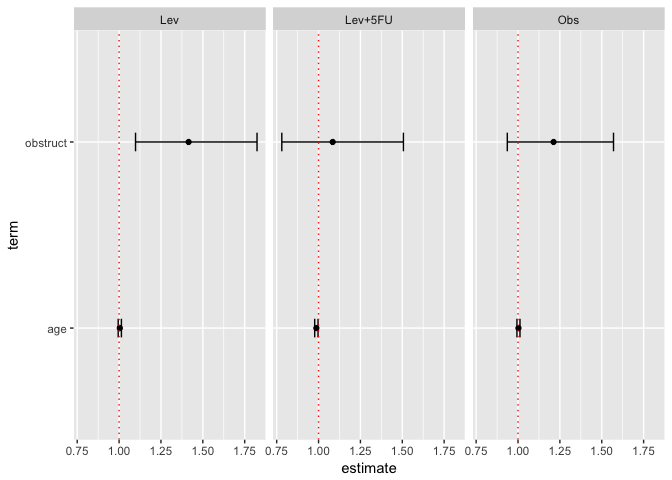

<!-- README.md is generated from README.Rmd. Please edit that file -->
survutils
=========

[](https://cran.r-project.org/package=survutils)
[](https://travis-ci.org/tinyheero/survutils)
[](https://cran.rstudio.com/web/packages/survutils)
[](https://cran.rstudio.com/web/packages/survutils)
[](https://anaconda.org/fongchun/r-survutils)
[](https://saythanks.io/to/tinyheero)

This package uses [functional programming
principles](http://adv-r.had.co.nz/Functional-programming.html) to
iteratively run Cox regression and plot its results. The results are
reported in [tidy data
frames](http://vita.had.co.nz/papers/tidy-data.pdf). Additional utility
functions are available for working with other aspects of survival
analysis such as survival curves, C-statistics, etc. It has the
following features (grouped by major topics):

Cox Regression

-   `get_cox_res`: Run univariate or multivariate cox regression.
-   `iter_get_cox_res`: Wrapper over `get_cox_res` to faciliate ease of
    multiple `get_cox_res` runs. Internally, this makes use of
    `purrr:map` to iterate over a list of features.
-   `plot_cox_res`: Generates a forest plot of the univariate or
    multivariate cox regression results from `get_cox_res`.

Kaplan Meier Estimates/Curves

-   `get_surv_prob`: Calculates the survival probability at specified
    times from a survival curve.
-   `get_nrisk_tbl`: Provides a number at risk table as [typically seen
    in
    publications](https://mcfromnz.wordpress.com/2011/11/06/kaplan-meier-survival-plot-with-at-risk-table/).
-   `get_logrank_res`: Runs a log-rank test.

Other

-   `get_c_stat`: Calculate C-statistics.

How to Install
==============

To get the released version from CRAN:

``` r
install.packages("survutils")
```

You can also get survutils through conda:

``` bash
conda install -c fongchun r-survutils
```

To install the latest developmental version from github:

``` r
devtools::install_github("tinyheero/survutils")
```

Cox Regression
==============

`survutils` provides a nice wrapper function `get_cox_res` that allows
you to quickly run an univariate or multivariate cox regression on a set
of data. The input data is a data.frame for instance (taking the colon
dataset from the `survival` R package as the example):

``` r
library("survival")
library("knitr")
library("survutils")
library("dplyr")

head(colon) %>%
    select(age, obstruct, time, status, rx) %>%
    kable()
```

|  age|  obstruct|  time|  status| rx      |
|----:|---------:|-----:|-------:|:--------|
|   43|         0|  1521|       1| Lev+5FU |
|   43|         0|   968|       1| Lev+5FU |
|   63|         0|  3087|       0| Lev+5FU |
|   63|         0|  3087|       0| Lev+5FU |
|   71|         0|   963|       1| Obs     |
|   71|         0|   542|       1| Obs     |

The relevant columns are:

-   `age` and `obstruct`: These are the features we want to regress on.
-   `time`: Time to event.
-   `status`: Event status (1 for event; 0 for non-event).
-   `rx`: Different treatment groups.

Then to run `get_cox_res`:

``` r
endpoint <- "time"
endpoint.code <- "status"
 
features <- c("age", "obstruct")
cox.res.df <- get_cox_res(colon, endpoint, endpoint.code, features)
#> Detected multiple features. Running multivariate cox regression
kable(cox.res.df)
```

| term     |   estimate|  std.error|   statistic|    p.value|   conf.low|  conf.high| test\_type |
|:---------|----------:|----------:|-----------:|----------:|----------:|----------:|:-----------|
| age      |  0.9983432|  0.0028040|  -0.5913434|  0.5542904|  0.9928717|   1.003845| multicox   |
| obstruct |  1.2677379|  0.0808045|   2.9359039|  0.0033258|  1.0820531|   1.485287| multicox   |

This runs a multivariate cox regression on the entire set of data. We
can plot the results using `plot_cox_res`:

``` r
plot_cox_res(cox.res.df)
#> Adding significance line
```


This gives us a forest plot with the hazard ratio and confidence
evidence for each feature. If we are interested in running cox
regression within each treatment group, we can make use of the `group`
parameter.

``` r
group <- "rx"
cox.res.df <- get_cox_res(colon, endpoint, endpoint.code, features, group)
#> Detected multiple features. Running multivariate cox regression
kable(cox.res.df)
```

| group   | term     |   estimate|  std.error|   statistic|    p.value|   conf.low|  conf.high| test\_type |
|:--------|:---------|----------:|----------:|-----------:|----------:|----------:|----------:|:-----------|
| Obs     | age      |  1.0026174|  0.0046032|   0.5678581|  0.5701313|  0.9936124|  1.0117040| multicox   |
| Obs     | obstruct |  1.2123725|  0.1319705|   1.4592591|  0.1444938|  0.9360576|  1.5702528| multicox   |
| Lev     | age      |  1.0042268|  0.0048754|   0.8651343|  0.3869651|  0.9946764|  1.0138689| multicox   |
| Lev     | obstruct |  1.4151910|  0.1293943|   2.6837694|  0.0072797|  1.0981822|  1.8237097| multicox   |
| Lev+5FU | age      |  0.9869403|  0.0051866|  -2.5345800|  0.0112582|  0.9769584|  0.9970242| multicox   |
| Lev+5FU | obstruct |  1.0844978|  0.1677669|   0.4835103|  0.6287334|  0.7805940|  1.5067186| multicox   |

Notice how the output data.frame now has cox regression results for each
treatment group (i.e. Obs, Lev, Lev+5FU). We can use the `plot_cox_res`
function again and pass in a `facet.formula` to plot these results very
easily:

``` r
plot_cox_res(cox.res.df,
             facet.formula = ". ~ group")
#> Adding significance line
```



This will facet the groups (per column) so that we can visualize the cox
regression results for each treatment group. The formula is the format
for `ggplot2::facet_grid` with the full [documentation listed
here](http://docs.ggplot2.org/current/facet_grid.html). In short, the
left hand side of the formula indicates what you want to facet by row.
The right hand side of the formula indicates what you want to facet by
column. By specifically `. ~ group`, we are indicating we do not want to
facet by row (this is indicated by the `.`) and we want to facet the
`group` variable by column.

We could have facetted by row too very easily:

``` r
plot_cox_res(cox.res.df,
             facet.formula = "group ~ .")
#> Adding significance line
```


There are also other options (see `?plot_cox_res` for full options) such
as the ability to add colors:

``` r
cox.res.df %>%
  mutate(sig_flag = p.value < 0.05) %>%
  plot_cox_res(facet.formula = ". ~ group", color.col = "sig_flag")
```


Running Cox Regression Multiple Times
=====================================

One useful function is the `iter_get_cox_res` which allows you to easily
run the `get_cox_res` function multiple times without needing to setup a
for loop yourself. This is useful in situations where you might need to
perform multiple pairwise multivariate Cox regression analysis to test
the independence of a novel prognostic biomarker to existing biomarkers.

The input to the `iter_get_cox_res` function is the same as
`get_cox_res` with the only exception being the features parameter which
takes a list of vectors. Each element in the list indicates the features
you want to perform Cox regression on:

``` r
features <- list(c("age", "obstruct"),
                 c("age"))

iter_get_cox_res.df <- 
  iter_get_cox_res(colon, endpoint, endpoint.code, features)
#> Detected multiple features. Running multivariate cox regression
#> Detected only one feature. Running univariate cox regression
```

The output is a data frame with a `iter_num` column indicating a
separate Cox regression result from `get_cox_res`:

``` r
kable(iter_get_cox_res.df, caption = "Iterative Cox Regression Results")
```

| iter\_num | term     |   estimate|  std.error|   statistic|    p.value|   conf.low|  conf.high| test\_type |
|:----------|:---------|----------:|----------:|-----------:|----------:|----------:|----------:|:-----------|
| 1         | age      |  0.9983432|  0.0028040|  -0.5913434|  0.5542904|  0.9928717|   1.003845| multicox   |
| 1         | obstruct |  1.2677379|  0.0808045|   2.9359039|  0.0033258|  1.0820531|   1.485287| multicox   |
| 2         | age      |  0.9975589|  0.0027949|  -0.8744983|  0.3818469|  0.9921094|   1.003038| unicox     |

One could plot then the multiple Cox regression with facet by row as
follows:

``` r
plot_cox_res(iter_get_cox_res.df,
             facet.formula = "iter_num ~ .", facet.scales = "free_y")
#> Adding significance line
```


By default, all features will appear in each facet. The `facet.scales`
parameter drops features on the y-axes that are not part of the specific
Cox regression.

You can even combine this with the group parameter:

``` r
iter_get_cox_res.group.df <- 
  iter_get_cox_res(colon, endpoint, endpoint.code, features,
                   group = "rx")
#> Detected multiple features. Running multivariate cox regression
#> Detected only one feature. Running univariate cox regression

kable(iter_get_cox_res.group.df, caption = "Iterative Cox Regression Results with Groups")
```

| iter\_num | group   | term     |   estimate|  std.error|   statistic|    p.value|   conf.low|  conf.high| test\_type |
|:----------|:--------|:---------|----------:|----------:|-----------:|----------:|----------:|----------:|:-----------|
| 1         | Obs     | age      |  1.0026174|  0.0046032|   0.5678581|  0.5701313|  0.9936124|  1.0117040| multicox   |
| 1         | Obs     | obstruct |  1.2123725|  0.1319705|   1.4592591|  0.1444938|  0.9360576|  1.5702528| multicox   |
| 1         | Lev     | age      |  1.0042268|  0.0048754|   0.8651343|  0.3869651|  0.9946764|  1.0138689| multicox   |
| 1         | Lev     | obstruct |  1.4151910|  0.1293943|   2.6837694|  0.0072797|  1.0981822|  1.8237097| multicox   |
| 1         | Lev+5FU | age      |  0.9869403|  0.0051866|  -2.5345800|  0.0112582|  0.9769584|  0.9970242| multicox   |
| 1         | Lev+5FU | obstruct |  1.0844978|  0.1677669|   0.4835103|  0.6287334|  0.7805940|  1.5067186| multicox   |
| 2         | Obs     | age      |  1.0019378|  0.0045949|   0.4213225|  0.6735196|  0.9929551|  1.0110018| unicox     |
| 2         | Lev     | age      |  1.0032152|  0.0048522|   0.6615663|  0.5082492|  0.9937198|  1.0128013| unicox     |
| 2         | Lev+5FU | age      |  0.9866753|  0.0051580|  -2.6006591|  0.0093045|  0.9767506|  0.9967007| unicox     |

``` r
plot_cox_res(iter_get_cox_res.group.df,
             facet.formula = "iter_num ~ group", facet.scales = "free_y")
#> Adding significance line
```


Kaplan Meier Estimates/Curves
=============================

If you have generated a Kaplan-meier, there are several functions you
can use to retrieve important statistics. For example, the
`get_surv_prob` function is used for retrieving survival probability at
certain times. Here is an example of how to generate survival
probabilities for just the “Obs” arm at times 100, 200, and 300:

``` r
library("dplyr")
library("survival")
library("survutils")

times <- c(100, 200, 300)

colon %>%
  filter(rx == "Obs") %>%
  survfit(Surv(time, status) ~ 1, data = .) %>%
  get_surv_prob(times)
#> [1] 0.9730159 0.9174603 0.8476190
```

Here is a small trick you can employ to get the survival probability
that for both arms simultaneously:

``` r
library("purrr")
library("reshape2")

surv.prob.res <- 
  colon %>%
  split(.$rx) %>%
  map(~ survfit(Surv(time, status) ~ 1, data = .)) %>%
  map(get_surv_prob, times)

surv.prob.res.df <- as_data_frame(surv.prob.res)
colnames(surv.prob.res.df) <- names(surv.prob.res)
surv.prob.res.df <-
  surv.prob.res.df %>%
  mutate(surv_prob_time = times)

surv.prob.res.df %>%
  melt(id.vars = "surv_prob_time", value.name = "surv_prob",
       variable.name = "group") %>%
  kable()
```

|  surv\_prob\_time| group   |  surv\_prob|
|-----------------:|:--------|-----------:|
|               100| Obs     |   0.9730159|
|               200| Obs     |   0.9174603|
|               300| Obs     |   0.8476190|
|               100| Lev     |   0.9708942|
|               200| Lev     |   0.9110224|
|               300| Lev     |   0.8543053|
|               100| Lev+5FU |   0.9785720|
|               200| Lev+5FU |   0.9439177|
|               300| Lev+5FU |   0.9059629|

You can also retrieve a number at risks table using the `get_nrisk_tbl`
function. Here we will use it to get the number at risk at time 100,
200, and 300:

``` r
survfit(Surv(time, status) ~ rx, data = colon) %>%
  get_nrisk_tbl(timeby = 100) %>%
  filter(time %in% c(100, 200, 300)) %>%
  kable()
```

| strata     |  time|  n.risk|
|:-----------|-----:|-------:|
| rx=Obs     |   100|     613|
| rx=Obs     |   200|     578|
| rx=Obs     |   300|     534|
| rx=Lev     |   100|     601|
| rx=Lev     |   200|     563|
| rx=Lev     |   300|     528|
| rx=Lev+5FU |   100|     593|
| rx=Lev+5FU |   200|     572|
| rx=Lev+5FU |   300|     549|

R Session
=========

``` r
devtools::session_info()
#> Session info -------------------------------------------------------------
#>  setting  value                       
#>  version  R version 3.4.2 (2017-09-28)
#>  system   x86_64, darwin13.4.0        
#>  ui       unknown                     
#>  language (EN)                        
#>  collate  en_CA.UTF-8                 
#>  tz       Europe/London               
#>  date     2018-02-10
#> Packages -----------------------------------------------------------------
#>  package    * version date       source                        
#>  assertthat   0.2.0   2017-04-11 cran (@0.2.0)                 
#>  backports    1.1.1   2017-09-25 CRAN (R 3.4.2)                
#>  base       * 3.4.2   2017-10-12 local                         
#>  bindr        0.1     2016-11-13 cran (@0.1)                   
#>  bindrcpp   * 0.2     2017-06-17 cran (@0.2)                   
#>  broom        0.4.3   2017-11-20 cran (@0.4.3)                 
#>  colorspace   1.3-2   2016-12-14 cran (@1.3-2)                 
#>  compiler     3.4.2   2017-10-12 local                         
#>  datasets   * 3.4.2   2017-10-12 local                         
#>  devtools     1.13.3  2017-08-02 CRAN (R 3.4.2)                
#>  digest       0.6.12  2017-01-27 CRAN (R 3.4.2)                
#>  dplyr      * 0.7.4   2017-09-28 cran (@0.7.4)                 
#>  evaluate     0.10.1  2017-06-24 CRAN (R 3.4.2)                
#>  foreign      0.8-69  2017-06-21 CRAN (R 3.4.2)                
#>  ggplot2      2.2.1   2016-12-30 cran (@2.2.1)                 
#>  glue         1.2.0   2017-10-29 cran (@1.2.0)                 
#>  graphics   * 3.4.2   2017-10-12 local                         
#>  grDevices  * 3.4.2   2017-10-12 local                         
#>  grid         3.4.2   2017-10-12 local                         
#>  gtable       0.2.0   2016-02-26 cran (@0.2.0)                 
#>  highr        0.6     2016-05-09 CRAN (R 3.4.2)                
#>  htmltools    0.3.6   2017-04-28 CRAN (R 3.4.2)                
#>  knitr      * 1.17    2017-08-10 CRAN (R 3.4.2)                
#>  labeling     0.3     2014-08-23 cran (@0.3)                   
#>  lattice      0.20-35 2017-03-25 CRAN (R 3.4.2)                
#>  lazyeval     0.2.1   2017-10-29 cran (@0.2.1)                 
#>  magrittr     1.5     2014-11-22 CRAN (R 3.4.2)                
#>  Matrix       1.2-11  2017-08-16 CRAN (R 3.4.2)                
#>  memoise      1.1.0   2017-04-21 CRAN (R 3.4.2)                
#>  methods      3.4.2   2017-10-12 local                         
#>  mnormt       1.5-5   2016-10-15 cran (@1.5-5)                 
#>  munsell      0.4.3   2016-02-13 cran (@0.4.3)                 
#>  nlme         3.1-131 2017-02-06 CRAN (R 3.4.2)                
#>  parallel     3.4.2   2017-10-12 local                         
#>  pillar       1.1.0   2018-01-14 cran (@1.1.0)                 
#>  pkgconfig    2.0.1   2017-03-21 cran (@2.0.1)                 
#>  plyr         1.8.4   2016-06-08 cran (@1.8.4)                 
#>  psych        1.7.8   2017-09-09 cran (@1.7.8)                 
#>  purrr      * 0.2.4   2017-10-18 cran (@0.2.4)                 
#>  R6           2.2.2   2017-06-17 CRAN (R 3.4.2)                
#>  Rcpp         0.12.13 2017-09-28 CRAN (R 3.4.2)                
#>  reshape2   * 1.4.3   2017-12-11 cran (@1.4.3)                 
#>  rlang        0.1.6   2017-12-21 cran (@0.1.6)                 
#>  rmarkdown    1.6     2017-06-15 CRAN (R 3.4.2)                
#>  rprojroot    1.2     2017-01-16 CRAN (R 3.4.2)                
#>  scales       0.5.0   2017-08-24 cran (@0.5.0)                 
#>  splines      3.4.2   2017-10-12 local                         
#>  stats      * 3.4.2   2017-10-12 local                         
#>  stringi      1.1.5   2017-04-07 CRAN (R 3.4.2)                
#>  stringr      1.2.0   2017-02-18 CRAN (R 3.4.2)                
#>  survival   * 2.41-3  2017-04-04 CRAN (R 3.4.2)                
#>  survutils  * 1.0.1   2018-02-10 local (tinyheero/survutils@NA)
#>  tibble       1.4.2   2018-01-22 cran (@1.4.2)                 
#>  tidyr        0.8.0   2018-01-29 cran (@0.8.0)                 
#>  tools        3.4.2   2017-10-12 local                         
#>  utils      * 3.4.2   2017-10-12 local                         
#>  withr        2.0.0   2017-07-28 CRAN (R 3.4.2)                
#>  yaml         2.1.14  2016-11-12 CRAN (R 3.4.2)
```
